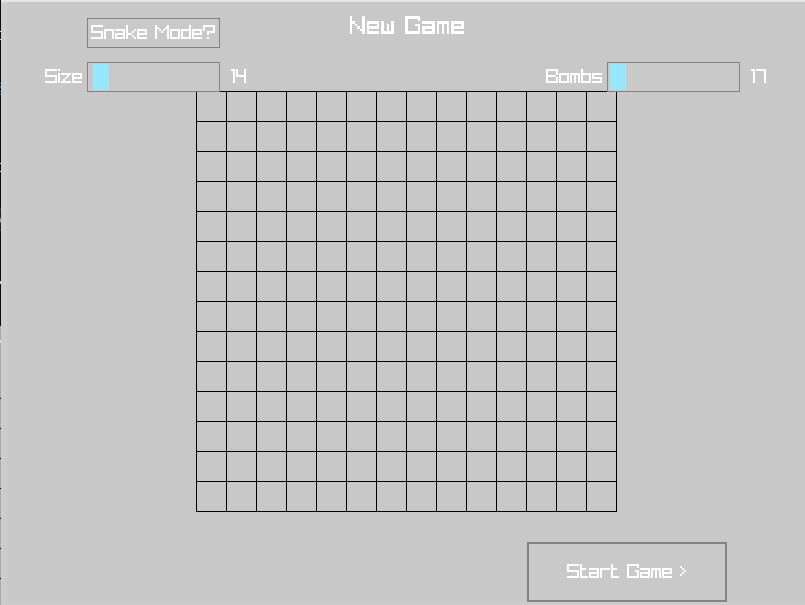
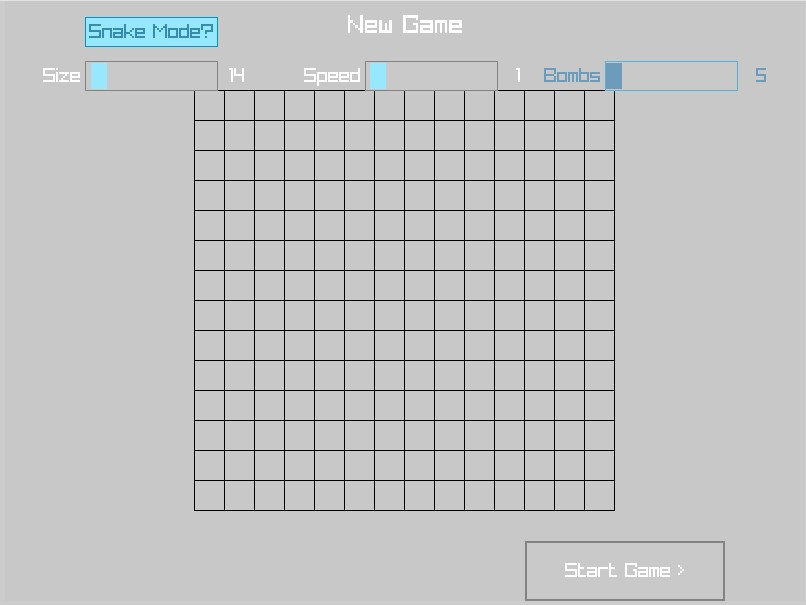
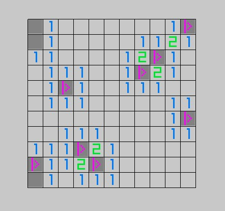
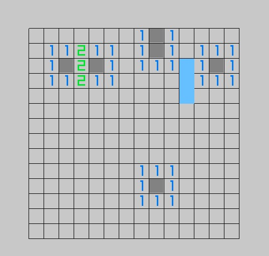

# Minesweeping-Snake

A quick-and-dirty minesweeper clone with a "snake" mode.
This project is built with [Raylib](https://github.com/raysan5/raylib), and [Raygui](https://github.com/raysan5/raygui).

Minesweeping-Snake can run on most targets,
but is tested on Unix and wasm (built with Empscripten).

## The Game

From the starting menu you can set your grid dimension, and desired number of bombs.

Additionally, you can enable **Snake Mode**,
which also lets you set the snake's speed.

### Minesweeper

In the normal mode, you can click to uncover blocks,
and right click to toggle a flag on them.
Flagged blocks cannot be uncovered without removing the flag first.

You win once you uncover all non-bomb blocks, and lose if you uncover a bomb.

### Snake Mode

In snake mode, you control the snake with w/a/s/d or the arrow keys.
The snake grows when it eats/uncovers a block; and blows if it eats a bomb.

To win, you have to uncover all non-bomb blocks.
Snake mode is very difficult, and sometimes impossible if the bomb placement
doesn't go your way.

